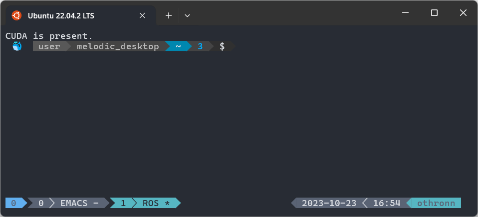
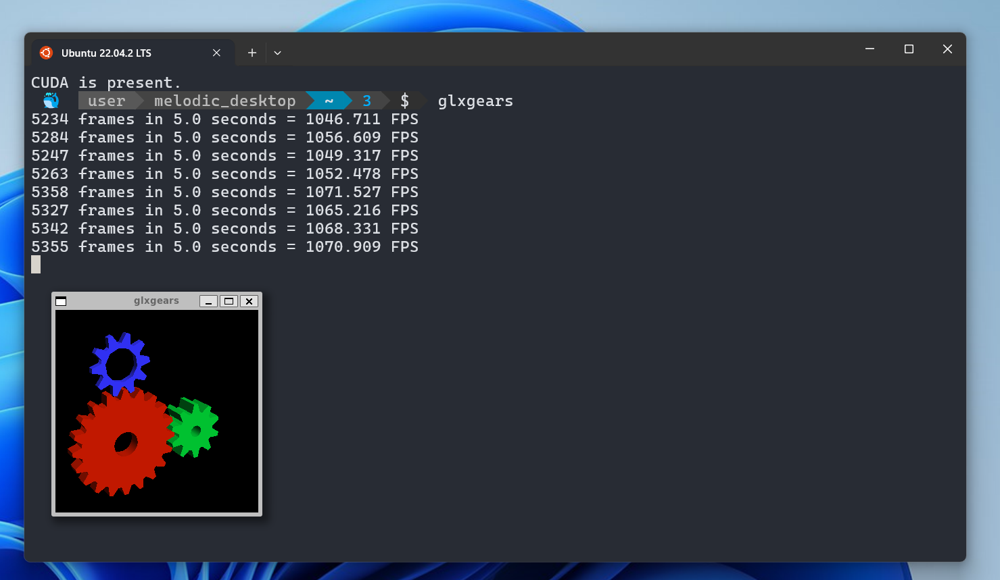

# ROSMelodicDocker
This repository contains the necessary elements (code and artifacts) to build
and run a ROS Melodic container suitable to execute GUI applications in Nvidia
and non-Nvidia docker environments. It includes the possibility to run
simulations for the TurtleBot 3.


*!!! Note: Do not clone this repository into a path containing a space !!!*

## Prerequisites
* A UNIX-like operating system, preferably Linux.
* An operational docker daemon.
* A terminal with a Nerd Font is highly recommended. ([Nerd Font Download page](https://www.nerdfonts.com/font-downloads))
* Standard Bash and basic ROS knowledge.
* A Nvidia graphics card capable of running hardware accelerated
  graphics. Although, any recent AMD or Intel GPU will also work flawlessly.

## Screenshots
The end result will be an Ubuntu 18.04 Docker container capable of running ROS
Melodic (GUI) systems.  A few virtual worlds are also included. The following
screenshots depict this perfectly.

The terminal after starting the container.
<p align="center">
  
</p>

Running GUI applications, including OpenGL should be possible.
<p align="center">
  
</p>


## How to build the container
A bash script is provided to build the container, it can be executed by entering the
following command:

```bash
   $ ./001_build_images.sh
```

## How to start the container
To start the container execute the script below:

```bash
   $ ./003_start_pxl_melodic_full_desktop.sh
```
This script will check the available GPU and start the container accordingly.

To use multiple bash shells in the container, It's advised to either work with
`tmux` or execute the script with prefix `005` from the host:

```bash
   $ ./005_attach_bash_to_melodic_full_desktop.sh
```

**Pro-tip: Learn to use `tmux`. It's awesome!**

## SLAM Toolbox with Turtlebot3

Launch a turlebot in a house world with slam_toolbox and rviz
```bash
   $ start_turtlebot3_slam_toolbox_demo.sh
```
Open a second terminal to control the turtlebot
```bash
   $ start_turtlebot3_teleop.sh
```

